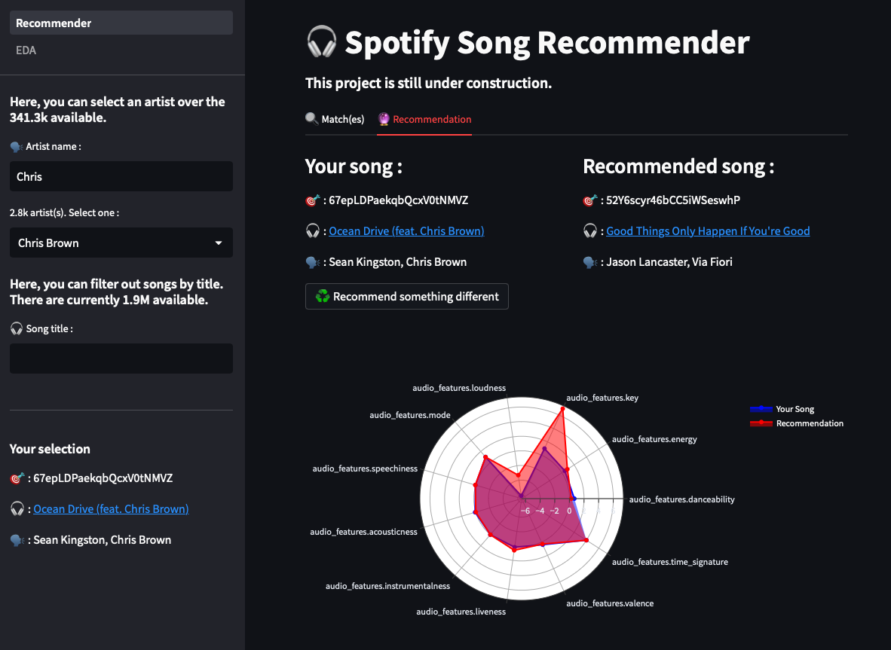
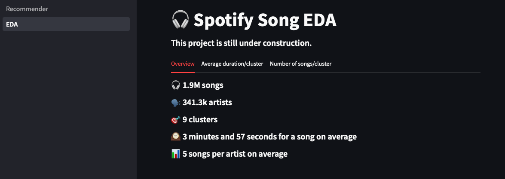

# Spotify Song Recommender with Streamlit

  
   

This project is a Spotify song recommender built with Streamlit. Given a user-selected song, the recommender suggests a song based on its cluster.

The recommender uses the k-means clustering algorithm to group songs based on their audio features. The audio features are obtained through the Spotify API.

To use the recommender, follow these steps:

1. Clone the repository to your local machine.
2. Install the required packages:

`pip install streamlit`

3. Run the Recommender.py file:

`streamlit run Recommender.py`

4. Once Streamlit is running, select a song by filtering by artist or title. The recommender will suggest a song based on its cluster.

## Files

Recommender.py: Streamlit application script.

## Credits

This project was built by Fabio SARMENTO PEDRO. Dataset was clustered in a different project. You can find that project [here](https://github.com/fabio1623/lab-api-wrappers).